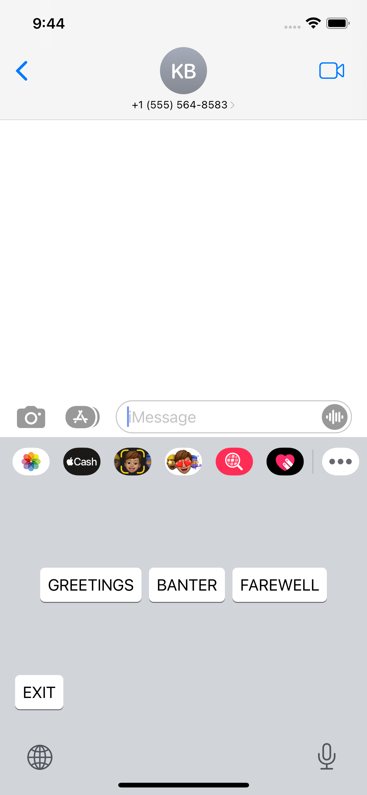

# Custom Keyboard Extension Challenge

Custom Keyboard Extension Challenge demos some SwiftUI (& Combine) concepts. This application is a challenge proposed by [Keys](http://www.thekeysapp.io/) the goal is complete the custom keyboard extensions previously started, using a provided endpoint to load content from API and render it in the keyboard UI  and as well some other requirements.

## Requirements

* iOS 15.4+
* Xcode 13.4.1+

## Architecture

* [Model-View-ViewModel (MVVM)](https://en.wikipedia.org/wiki/Model–view–viewmodel) - Custom Keyboard Extension Challenge uses Model-View-ViewModel (MVVM) as software design pattern, that way our project is structured to separate program logic and user interface controls
* [Combine](https://developer.apple.com/documentation/combine) - Combine framework was choosen because its provides a declarative Swift API for processing values over time, so we can connect the data layer with the screen doing the necessary treatments automatically and above all it is a native framework, thus avoiding unnecessary dependencies
* [Dependency Injection](https://en.wikipedia.org/wiki/Dependency_injection) - To improve the reusability of our code, I created the modules using a famous design pattern (Dependency Injection) that makes a class independent of its dependencies. It achieves that by decoupling the usage of an object from its creation. This helps me to follow SOLID’s dependency inversion and single responsibility principles, using [Factory](https://en.wikipedia.org/wiki/Factory_method_pattern) pattern, we could create our objects without exposing the Dependency Injection logic to the client and refer to newly created object using a common interface.
* [Clean Architecture](https://en.wikipedia.org/wiki/Hexagonal_architecture_(software)) - With clean architecture principle I'm able to create a system that is intrinsically testable, with all the benefits that implies. When any of the external parts of the system become obsolete, like the database, or the web framework, I can replace those obsolete elements with a minimum of fuss.
* [Protocol Oriented Programming](https://medium.com/swlh/introduction-to-protocol-oriented-programming-1ff3862f9a3c) - Unlike with class inheritance, in which the actual properties and methods are implemented, protocols only define requirements. This is still highly beneficial, because it enables me to expressively define types that are certain to have the expected state and behavior. This also aids in unit testing protocol-defined types, e.g., using mock objects that conform to the same protocols. Additionally, protocols can be extended to provide default implementations. This enables me to avoid duplicating code, and it keeps my model definitions flexible to be extended or modified later.
* [Network Layer](https://www.swiftbysundell.com/articles/creating-generic-networking-apis-in-swift/) - Creating abstraction layers helps improve our code drastically by providing three major benefits: centralization, simplicity and better testing. In our code, we want to expose the policy while hiding the detail. This decoupling between our policy and detail allows us to switch and easily refactor implementation, in our code using a Netwok Layer we can achieve the benefits below:
  * View controllers should never know about the networking APIs. They shouldn’t even care whether the data is coming from the API or the local database, e.g. Coredata or SQLite.
  * The only layer that should call the networking API is the service layer.
  * The view controllers should ask the service to provide the data.
  * The service should not know about the API server and the format of the data that is sent or received to or from the API server.
  * Only the network layer should know these details.

## Challenge Requirements

- [x] All of the UI work should be done in SwiftUI. I already setup the initial rendering of our root SwiftUI view in `RootView.swift`. You should be able to implement a typical SwifUI application from there.

You can send a `GET` request to `https://frontend-coding-challenge-api.herokuapp.com/getContent` to fetch the content.
  - [x] Remember to display a loading state while the content is being fetched.
  - [x] The API will randomly (about 1/5 times) return an error with status code `500` and json data `{ error: 'Random Error' }`. Make sure you handle this.

Tapping each button should output its content to the text input (see [resources](#resources) below).
  - [x] When you tap the first time, the app should output the first (`index == 0`) piece of attached content. When you tap the second time, it should output the second piece, etc
  - [x] When you've reached the last piece of content, tapping again should cycle back to the beginning

TIP: inspect the data coming back from the api to figure out the structure of the extra content.
  - [x] Match Apple's keyboard styling as best you can.
  - [x] Make sure to include a button to exit your custom keyboard and take the user back to the default keyboard
  - [ ] Long-press delete functionality that mimics Apple's
  - [x] Long-press on a button show's a popup list with all of the content options.
     * Selecting one should output it to the text input
  - [x] Use some sort of frontend caching/storage to avoid showing a loading state every time the user toggles in and out of the keyboard.

Other fun or useful UI improvements. This is up to you! Some examples:
  - [ ] A moving progress bar on each button that shows how far the user has progressed in the content
  - [ ] Animate the text moving from the button up to the text input
  - [x] Transitions between different states (loading, error, rendering the content)
  - [x] Dark mode

## Where to Go From Here?

Close this repo and check it out the final folder with all the implementations we discuss above, you can also check the original challenge requirements below as well the starter project from the start folder.

If you find any mistakes or you can't figure out something, raise a question. I will get back to you asap.

   

# Create an iOS Custom Keyboard extension
Given that the custom keyboard extension is the heart of our application, we'd like to see you create one of your own!

## Goal:
Complete the custom keyboard extension that's started in this repo. Use the provided endpoint (see [Requirements](#requirements) below) to load content from an API and render it in the keyboard UI (see [example layout](#example-layout) at the bottom of this page). 

## Requirements
* All of the UI work should be done in SwiftUI. I already setup the initial rendering of our root SwiftUI view in `RootView.swift`. You should be able to implement a typical SwifUI application from there.
  * Note `KeyboardViewController` acts as the lifecycle controller for the entire keyboard. Somewhat like the AppDelegate for the extension.
* You can send a `GET` request to `https://frontend-coding-challenge-api.herokuapp.com/getContent` to fetch the content.
  * Remember to display a loading state while the content is being fetched.
  * The API will randomly (about 1/5 times) return an error with status code `500` and json data `{ error: 'Random Error' }`. Make sure you handle this.
* Tapping each button should output its content to the text input (see [resources](#resources) below).
  * When you tap the first time, the app should output the first (`index == 0`) piece of attached content. When you tap the second time, it should output the second piece, etc
  * When you've reached the last piece of content, tapping again should cycle back to the beginning
  * TIP: inspect the data coming back from the api to figure out the structure of the extra content.
* Match Apple's keyboard styling as best you can.
* Make sure to include a button to exit your custom keyboard and take the user back to the default keyboard

## Additional (please implement at least 1)
* Long-press delete functionality that mimics Apple's
* Long-press on a button show's a popup list with all of the content options.
  * Selecting one should output it to the text input
* Use some sort of frontend caching/storage to avoid showing a loading state every time the user toggles in and out of the keyboard.
* Other fun or useful UI improvements. This is up to you! Some examples:
  * A moving progress bar on each button that shows how far the user has progressed in the content
  * Animate the text moving from the button up to the text input
  * Transitions between different states (loading, error, rendering the content)
  * Dark mode

## Instructions for running the keyboard on device or simulator
1. Open **keysCustomKeyboardChallenge.xcodeproj** in Xcode
2. Select target **keyboard** from the target dropdown list and a simulator or your own device to run it on.  
<image src="./challengeAssets/keyboard-target-selection.png">

3. You will see a popup with options for a "host" application where you can run the keyboard extension. You can choose any application to run the keyboard, but **messages** is probably the most relevant  
<image src="./challengeAssets/app-popup.png" width="200" />

4. You will need to turn on the keyboard in **Settings**. In the simulator/device navigate to **Settings** -> **General** -> **Keyboard** -> **Keyboards** -> **Add New Keyboard** -> **keysCustomKeyboardChallenge**. Then navigate back to **Messages** and you should be able to switch to the keyboard using the globe button. [See demo video here](https://frontend-coding-challenge-api.herokuapp.com/)

## Resources
* [Apple's iOS Custom keyboard getting started guide (the initial setup is already completed)](https://developer.apple.com/documentation/uikit/keyboards_and_input/creating_a_custom_keyboard)
* [How to output text from an iOS Custom Keyboard](https://developer.apple.com/documentation/uikit/uitextdocumentproxy)

## Example layout:

# KeysCustomKeyboardChallenge
